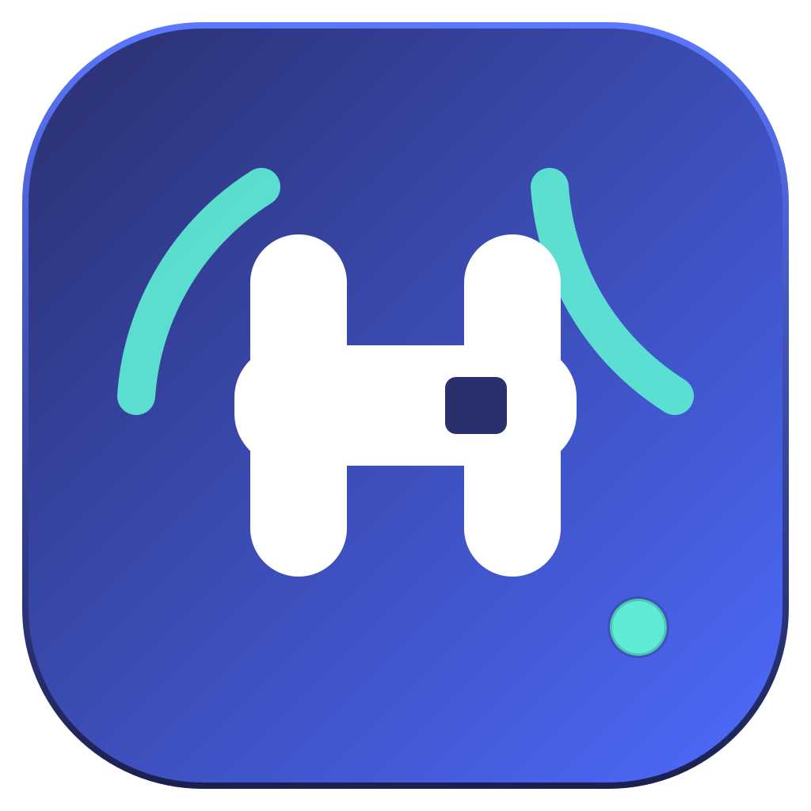

# DeepSeek Harness Desktop

> 独立 macOS 桌面端，与 [DeepSeek Harness](https://github.com/deepseek-ai/deepseek-harness) 保持同步 —— 内置本地千问视觉模型（Qwen3-VL）识图 MCP、上游同步与自更新。



DeepSeek Harness Desktop 把 DeepSeek Harness 的 Web 界面装进原生 macOS 应用：
不再是「打开终端跑 `dsh web` 再开浏览器」，而是双击即用；同时解决了三件
日常维护的事：

1. **同步上游源码** —— 应用检测 `deepseek-ai/deepseek-harness` 的 npm 发行版
   与 GitHub master 动态，一键（或自动提示）把最新版 harness 安装进应用数据
   目录并热重启，会话历史保留；
2. **应用自更新** —— 应用本体通过 GitHub Releases（electron-updater）自动更新，
   CI 会跟随上游版本自动打包发布；
3. **本地识图 MCP** —— 内置千问视觉模型 MCP 服务器（`mcp__qwen-vision__*`），
   识图/看图说话/OCR 全部在本机 Ollama 上完成，图片不出设备。

本应用是 DeepSeek Harness 的**独立社区封装**，不是 DeepSeek 官方产品。

---

## 功能一览

| 能力 | 说明 |
|---|---|
| 桌面化 harness | 应用内启动 `dsh --profile web`，自动分配端口，独立 `$DSH_HOME`，与 CLI 版数据隔离 |
| 上游同步 | npm 发行频道（`@deepseek-ai/dsh`）+ GitHub 最新提交双通道探测；一键/自动同步并热重启 |
| 应用自更新 | electron-updater + GitHub Releases；下载完成一键重启安装 |
| 本地识图 | `analyze_image` / `describe_image` / `ocr_image` / `vision_status` 四个 MCP 工具，Qwen3-VL 本机推理 |
| 模型管理 | 控制中心内查看/下载/切换视觉模型，自动拉起 Ollama 守护进程 |
| 品牌 | 独立 Logo（驭架「H」+ 同步弧）、icns 应用图标、托盘图标、DMG 安装界面、About/许可声明 |

## 安装与构建

要求：macOS（Apple Silicon）、Node.js ≥ 20（打包时）、npm。
运行时依赖：Ollama（可选，识图功能需要；应用会引导安装）。

```sh
git clone https://github.com/galanime/harness-desktop.git
cd harness-desktop
npm install                      # 开发依赖（Electron 等）
npm run install:harness          # 安装上游 harness 运行时（@deepseek-ai/dsh）
npm run build:icons              # 生成 icns / PNG / 托盘 / DMG 背景
npm start                        # 开发模式运行
npm run dist                     # 打包：dist/*.dmg 与 *.zip（arm64，未签名）
```

发布（打包并上传 GitHub Release）：

```sh
npm run release                  # 需要 GH_TOKEN 环境变量
```

## 使用

1. 启动后主窗口即 harness 界面（首次启动会初始化 `web` profile，稍候几秒）；
2. 菜单栏「帮助 → 控制中心」管理同步、更新与识图模型；
3. 识图：在对话中让模型「分析这张图」，模型会自动调用
   `mcp__qwen-vision__analyze_image` 等工具（图片传本地路径）；
4. 上游发布新版本时，应用会提示同步；也可以在控制中心手动同步。

## 架构

```
Electron 主进程
 ├─ HarnessManager   spawn dsh --profile web（系统 Node 或 ELECTRON_RUN_AS_NODE 兜底）
 │    └─ $DSH_HOME = ~/Library/Application Support/DeepSeek Harness Desktop/dsh-home
 │        └─ cordis.patch.yml（insert mcp-qwen-vision 实例 → dsh-mcp-client）
 ├─ SyncService      npm 发行版安装进用户数据目录 → 重启 harness
 ├─ UpdaterService   electron-updater → GitHub Releases
 ├─ OllamaManager    ollama serve 守护 + 模型拉取进度
 └─ 控制中心窗口     状态/同步/模型/设置/关于
识图 MCP（qwen-vision-mcp）
 └─ stdio MCP 服务器 → Ollama /api/chat（qwen3-vl:4b 默认）
```

更新链路：

- **harness 运行时**：GitHub 上游更新 → npm 发布新 rc → 应用提示 → `npm install` 到应用数据目录 → 重启 harness；
- **应用本体**：仓库 CI 检测上游变化 → 打包 macOS 产物 → GitHub Release → electron-updater 自动下载安装。

## 目录结构

```
harness-desktop/
├── src/main/            # Electron 主进程
├── src/preload/         # 控制中心 preload（沙箱）
├── src/renderer/        # 启动页 + 控制中心
├── mcp/qwen-vision-mcp/ # 千问识图 MCP 服务器
├── scripts/             # 图标生成 / harness 安装
├── brand/               # Logo、托盘、许可副本
├── build/               # 打包资源（生成）
└── harness-runtime/     # 上游运行时（生成，不入库）
```

## 许可与归属

- 本项目：MIT License（见 [LICENSE](LICENSE)），© 2026 galanime and contributors；
- DeepSeek Harness：MIT，© DeepSeek；
- Qwen3-VL 模型权重：Apache-2.0，© Alibaba Cloud；
- 其余第三方组件声明见 [THIRD_PARTY_NOTICES.md](THIRD_PARTY_NOTICES.md)。

> 免责声明：「DeepSeek」名称仅用于指代其包装的上游开源项目
> （MIT 许可）。本应用与 DeepSeek 公司无隶属关系。
